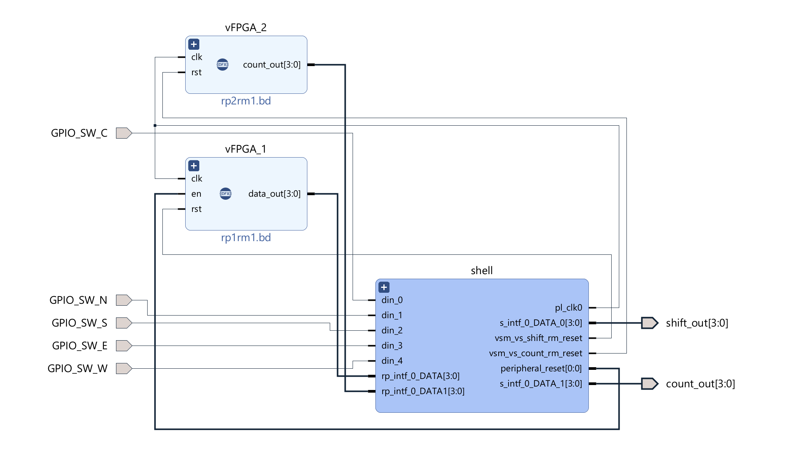
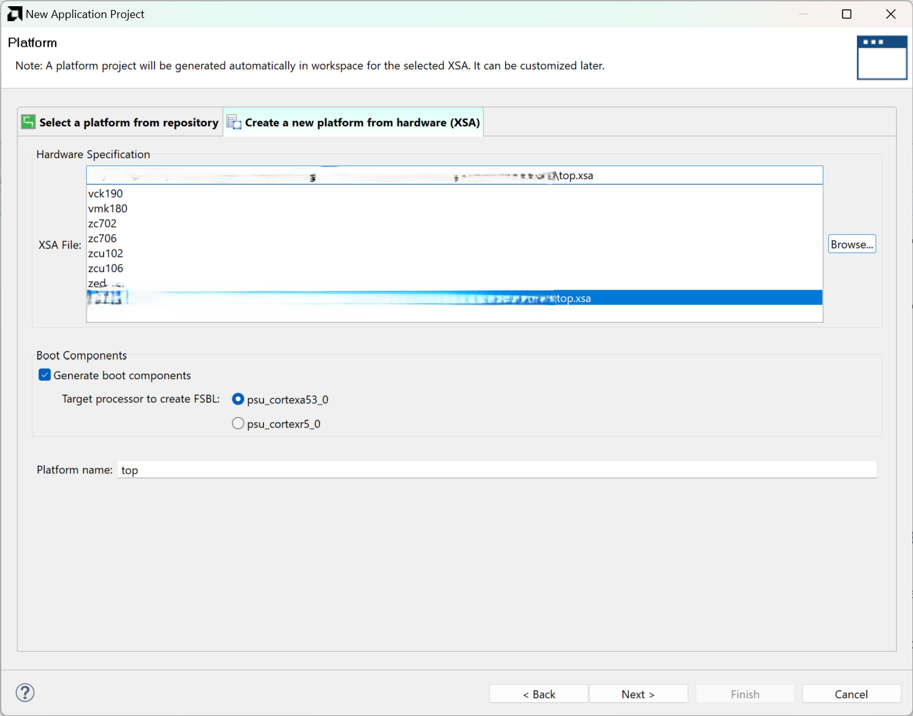
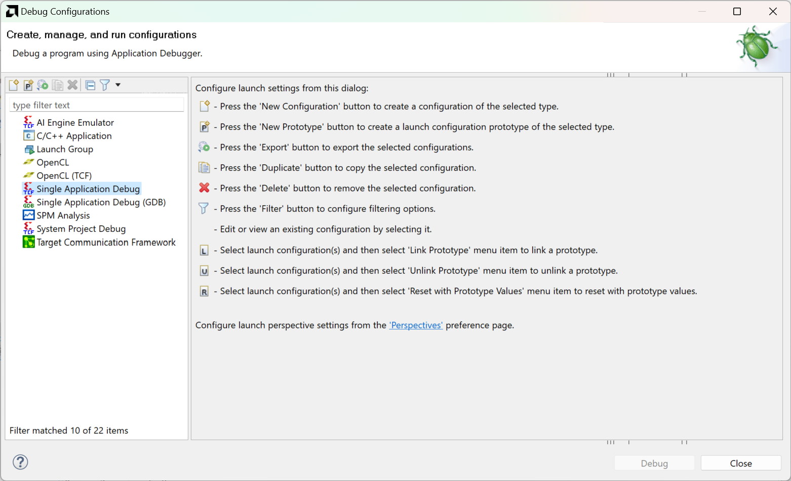
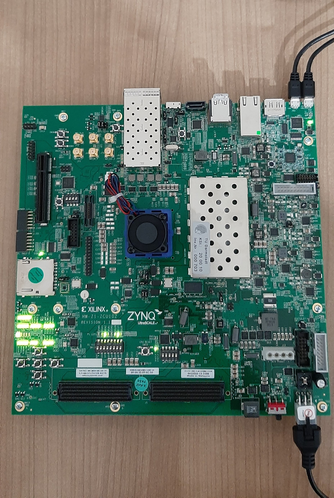
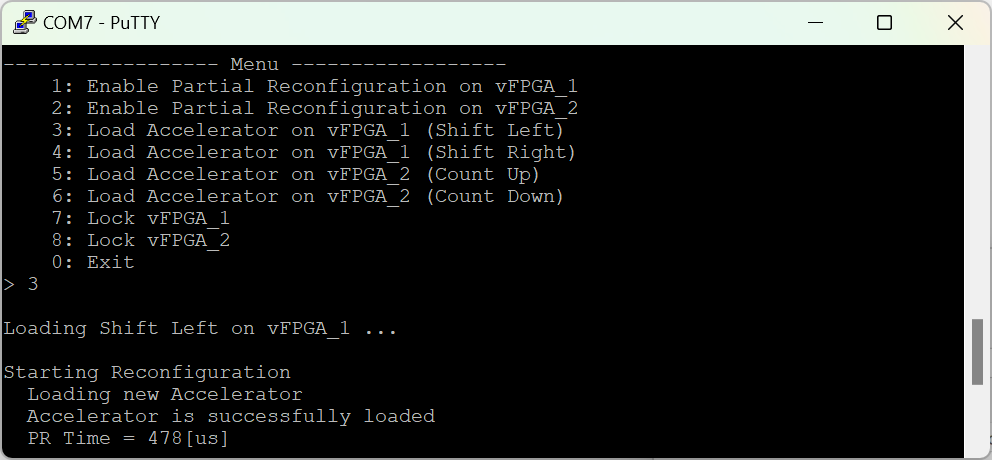
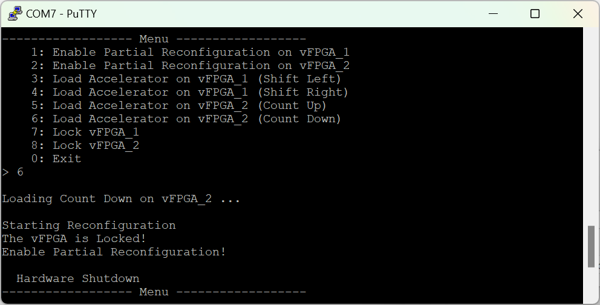
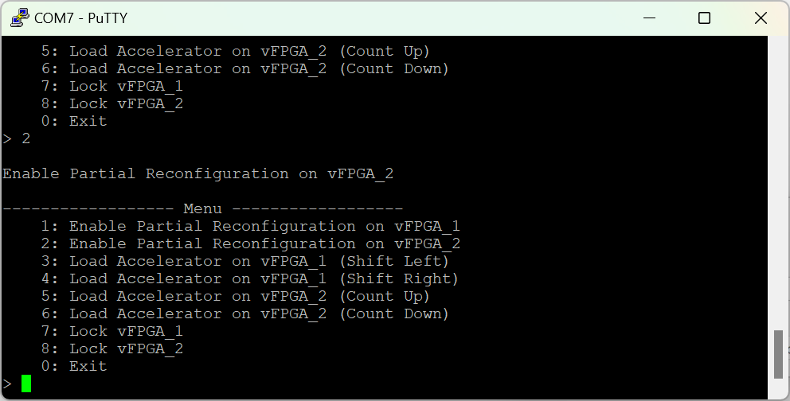

# Secure FPGA Provisioning

In this repository, you can find the initial version of Secure FPGA Provisioning, which provides secure FPGA-based acceleration and enables IP protection on FPGA-enabled SoCs within [CROSSCON project](https://crosscon.eu/). This work is part of deliverable 4.2 (CROSSCON Extension Primitives to Domain Specific Hardware Architectures — Initial Version) and deliverable 3.2 (CROSSCON Open Security Stack – Initial Version). The repository contains three folders. Folder Bitstreams contains a primary bitstream and four partial bitstreams. Each partial bitstream represents a configuration file corresponding to a specific accelerator targeting a virtual FPGA, e.g., file vfpga_1_shift_left_partial.bin configures a shift left accelerator on vFPGA_1. Folder figures shows the demo sequence, and folder sdk contains the Xilinx Vitis source files to replicate the demo. For a detailed description of the Secure FPGA Provisioning demo, please refer to the deliverable 4.1 (CROSSCON Extensions to Domain Specific Hardware Architectures Documentation — Draft) of the CROSSCON project.

## What is the Demo about?

In this demo, an FPGA shell is implemented to take care of partial configuration through an internal configuration port (ICAP) port, which is internal to the FPGA fabric. In addition to the shell, two logically-isolated virtual FPGAs are implemented on the FPGA, each of which can be managed separately.
On vFPGA_1, we can run a shift circuit (shifting right or left); on vFPGA_2, we can run a counter circuit (counting up or down). Figure 1 shows the block design of the FPGA shell, vFPGA_1 and vFPGA_2.

    

 

Figure 1: FPGA Fabric Split into Shell, vFPGA_1 and vFPGA_2 

 
The figure also shows the external pins of our designs, count_out and shift_out, connected to the eight PL LEDs. Each vFPGA is connected to 4 PL LEDs on the board (See Figure 13). The LED blinking pattern will reflect the direction (counting up or down) and (shifting right or left). The inputs on the design are connected to general-purpose switches (SW14, SW15, SW16, SW17 and SW18) to control the configuration controller manually.  
The configuration controller in the shell receives the required information from a trusted application, controls the FPGA resources, and provides FPGA services to other applications, i.e., which vFPGA and which bitstream to configure on it. 
The PCAP port can program the FPGA from the processing system, i.e., Arm cores. However, it can be used by any application to do so. To prevent unauthorized access to FPGA logic, the PCAP is deactivated (PCAP and ICAP work exclusively). The controlling application is responsible for deactivating PCAP, enabling ICAP, configuring the FPGA, and loading partial bitstreams in memory in preparation for the partial configuration process.  This represents TA_FPGA, as discussed in D4.1.

## How to run it?
Due to the known issue of ([ZCU102](https://support.xilinx.com/s/article/71968?language=en_US)) Evaluation Board, we are running the demo in the debug mode. Due to this limitation, we could only test basic functionality with the FPGA. That is, we used a user interface to interact with the controlling application rather than implementing another application that communicates with the controlling application to request FPGA services. To recreate the Vitis workspace, follow these simple steps:

 1. Launch Xilinx Vitis and choose a location for your workspace. The version used in the demo is Vitis 2023.1.

    

 

Figure 2: Xilinx Vitis 

 
 2. Choose "Create Application Project" and click next.

    

 

Figure 3: Xilinx Vitis: Create New Application Project 

 
 3. In the tab "Create a new platform from hardware (XSA)", click on Browse .. and choose the file ([Bitstreams/top.xsa](https://github.com/crosscon/FPGA_TEE/blob/main/Bitstreams/top.xsa)). This file contains a description of the entire platform, including the hardware design representing the shell.

    

 

Figure 4: Loading Platform Description 

 
Once loaded, keep the default settings and click next. In the field "Application project name," provide the application name. Make sure the application is associated with processor psu_cortexa53_0 and click next. Keep default settings and click next.

4. From "Templates", choose an empty application (c) and click finish.

    

 

Figure 5: Setting up a new Application from Template 

5. In the Explorer tab, you can see the application_name [standalone_psu_cortexta53_0]. Expand it and right-click on the src folder. Choose from the menu import resources ... 
In the field "From directory", provide the path to ([sdk/sources/](https://github.com/crosscon/FPGA_TEE/tree/main/sdk/sources)), the source files will appear in the window, select them and click finish. This application deactivates the PCAP and controls the application running on the FPGA shell.

    

 

Figure 6: Adding Source Files to the Application 

 
6. Right-click on the application_name [standalone_psu_cortexta53_0] and choose Build Project.

    

 

Figure 7: Compiling the Application 

7. In the main toolbar, select the small drop menu next to the run symbol and select "Run Configurations.." Select "Single Application Debug" and create a new one.

    

 

Figure 8: Creating Run Configurations 

8. Keep the default values in the Main tab and move to the next tab.

    

 

Figure 9: Main tab - Run Configurations 

9. In the Application tab, make sure application_name appears in the Project field. If not, browse for the generated elf file.

    

 

Figure 10: Application tab - Run Configurations 

 
10. Click on the "hier_mb_mb" from the "Summary" window and leave the Project and Application fields empty. Click on Edits for more advanced options. Add the partial bitstream files ([Bitstreams/*.bin](https://github.com/crosscon/FPGA_TEE/tree/main/Bitstreams)) in the window "Data Files to download before launch" in the locations shown in the figure.

    

 

Figure 11: Uploading Partial Bitstreams - Run Configurations 

 This step will upload the partial bitstreams in the memory allocated for the FPGA shell.

11. In the "Target Setup" tab, fill the "Hardware Platform" and "Bitstream File" with the files provided in  ([Bitstreams/top.xsa](https://github.com/crosscon/FPGA_TEE/blob/main/Bitstreams/top.xsa)) and ([Bitstreams/top.bit](https://github.com/crosscon/FPGA_TEE/blob/main/Bitstreams/top.bit))
In the "Summary" window, you will see the run steps.

    

 

Figure 12: Target Setup - Run Configurations 

Now connect the USB and JTAG on the ZCU102 board to your machine, as shown below:

    

 

Figure 13: ZCU102 Connections 

Ensure SW6 is set to JTAG mode (all four switches are on). Then, open a serial terminal, COM7, with a baud rate 115200. 
Once switched on, run the application in Xilinx Vitis. Once the FPGA is configured, we can see the Menu on the terminal.
The first two options unlock the virtual FPGAs to be reconfigured. In the figure below, 1 was typed in, and vFPGA_1 was activated.

    

 

Figure 14: Main Menu - FPGA Shell 

 
Now, we can freely configure vFPGA_1. By typing 3, the shift left accelerator is loaded on vFPGA_1. 

    

 

Figure 15: Configuring vFPGA_1 - FPGA Shell 

  Typing 6 in the terminal shows that vFPGA_2 cannot be configured before being activated first.
 

    

 

Figure 16: Configuring vFPGA_2 - FPGA Shell 

Activate vFPGA_2 by typing 2 in. 

    

 

Figure 17: Activating vFPGA_2 - FPGA Shell 

 Now, vFPGA_2 can be reconfigured.

    

 

Figure 18: Exiting Demo 

 We can freely lock, activate and switch between the different accelerators on the vFPGAs. 
Our next step is to implement a second trusted application that will communicate with the trusted application controlling the FPGA services and implement the necessary cryptographic operations to enable partial bitstream decryption and verification.

## License

See the LICENSE file.

## Acknowledgment

The work presented in this repository is part of the [CROSSCON project](https://crosscon.eu/) that received funding from the European Union’s Horizon Europe research and innovation programme under grant agreement No 101070537.

    

    

